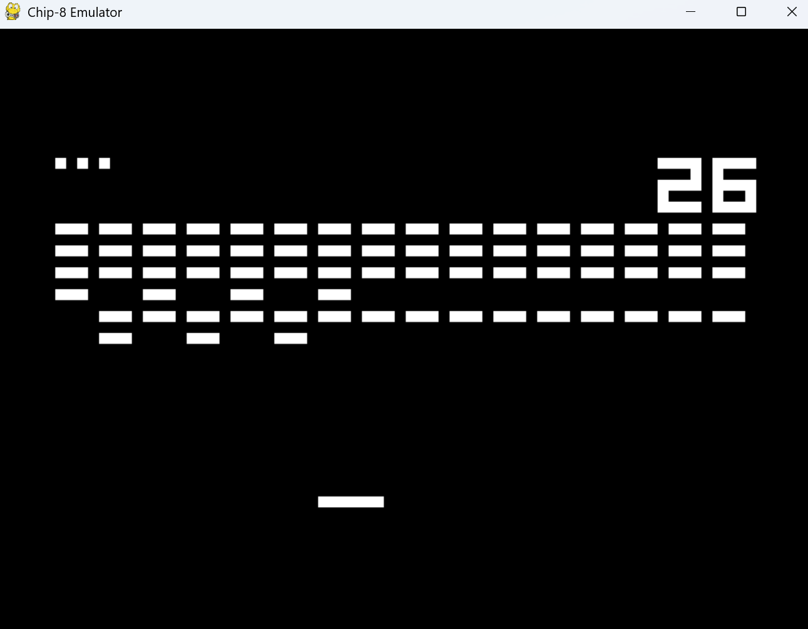

# ChipPy-8
Chip-8 Emulator written in Python

## Installation
Clone the repository
```bash
git clone https://github.com/RJ-Tan/ChipPy-8.git
```
Move into project directory
```bash
cd ChipPy-8
```
Install project dependencies
```bash
pip install -r requirements.txt
```

## Usage
py main.py <rom_path> <instruction_speed=700>
```bash
py .\src\main.py '.\TestRoms\Brix [Andreas Gustafsson, 1990].ch8' 500
```
Result:


## Acknowledgements

https://en.wikipedia.org/wiki/CHIP-8

https://tobiasvl.github.io/blog/write-a-chip-8-emulator/

https://github.com/Timendus/chip8-test-suite

https://github.com/kripod/chip8-roms

## License 
[MIT](https://choosealicense.com/licenses/mit/)